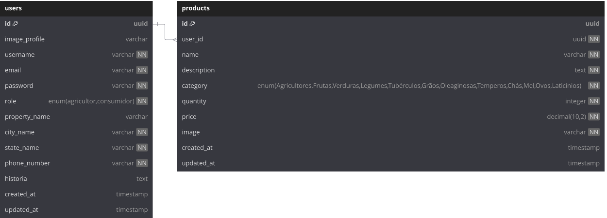

# API Acaiaca Agricultores - Back-end Node.js

Bem-vindo ao repositório do back-end da API Acaiaca Agricultores! Este projeto é uma API RESTful desenvolvida com Node.js e Express, utilizando Sequelize para a comunicação com um banco de dados PostgreSQL. Ele oferece funcionalidades para gerenciamento de usuários (agricultores e consumidores) e produtos agrícolas. As rotas são protegidas por autenticação JWT e incluem upload de imagens.


📦 **Repositório:** `Back‑end_NodeJS`

## 🚀 Sobre

A API do Acaiacá conecta produtores rurais a uma aplicação front‑end, permitindo operações como autenticação, gerenciamento de produtores, produtos e pedidos, devolvendo dados em formato JSON.

Este back‑end serve o Front‑end React e pode ser usado também como base para outras integrações.

## 💻 Tecnologias utilizadas

-  **Node.js** – ambiente de execução JavaScript.
-  **Express** – framework para criação de rotas e middlewares.
-  **PostgreSQL** – sistema de gerenciamento de banco de dados relacional.
-  **Sequelize** – ORM para Node.js com suporte a PostgreSQL.
-  **JWT** – autenticação baseada em token.
-  **Dotenv** – tratamento de variáveis de ambiente.
-  **CORS**, ,  – outras dependências úteis para segurança e parsing de dados.

## 🏗️ Arquitetura do Projeto

A aplicação segue uma arquitetura **MVC (Model-View-Controller)**, garantindo organização e separação de responsabilidades:

- **Controllers**: manipulam a lógica das requisições e interações com os modelos.
- **Models (Sequelize)**: definem os esquemas e relacionamentos com o banco PostgreSQL.
- **Routes**: controlam os endpoints da API.
- **Middlewares**: funções intermediárias como autenticação, validação e tratamento de erros.
- **Services (opcional)**: camada adicional para lógica de negócio reutilizável.

Essa estrutura facilita a manutenção, testes e escalabilidade da aplicação.

---

## 🗂️ Diagrama ER - Banco de Dados

Este é o modelo relacional das principais tabelas do PostgreSQL usado na aplicação:

```dbdiagram
Table users {
  id uuid [pk, default: `gen_random_uuid()`]
  image_profile varchar
  username varchar [not null]
  email varchar [not null, unique]
  password varchar [not null]
  role enum('agricultor', 'consumidor') [not null]
  property_name varchar
  city_name varchar
}

Table products {
  id uuid [pk, default: `gen_random_uuid()`]
  name varchar
  description text
  price numeric
  image_url varchar
  userId uuid [ref: > users.id]
}

Table orders {
  id uuid [pk, default: `gen_random_uuid()`]
  productId uuid [ref: > products.id]
  consumerId uuid [ref: > users.id]
  quantity int
  status enum('pendente', 'confirmado', 'entregue', 'cancelado')
  created_at timestamp
}
```




## ⚙️ Instalação

```bash
# 1. Clone o repositório
git clone https://github.com/Acaiaca-Agricultores/Back-end_NodeJS.git

# 2. Entre no diretório
cd Back-end_NodeJS

# 3. Instale as dependências
npm install
# ou
yarn install
````

## 🛠️ Configuração

Crie um arquivo `.env` na raiz com pelo menos:

```
PORT=3000
DB_URI=...
JWT_SECRET=...
# outros parâmetros como SALT_ROUNDS, etc.
```

## 🚀 Executando localmente

```bash
npm run dev       # com nodemon
npm start         # modo produção
```

A API estará disponível em `http://localhost:<PORT>`.

## 📚 Endpoints

**Autenticação**
| Método | Endpoint | Função |
|--------|-----------------|----------------------------------|
| POST | `/auth/register`| Criar novo usuário/produtor |
| POST | `/auth/login` | Realizar login e receber token |

**Produtores**

- `GET /producers` – Listar produtores
- `GET /producers/:id` – Detalhe de um produtor
- `POST /producers` – Criar um produtor (autenticado)
- `PUT /producers/:id` – Atualizar produtor
- `DELETE /producers/:id` – Excluir produtor

**Produtos**

- `GET /products` – Listar produtos
- `GET /products/:id` – Detalhe do produto
- `POST /products` – Criar produto (autenticado)
- `PUT /products/:id` – Atualizar produto
- `DELETE /products/:id` – Deletar produto

**Pedidos**

- `GET /orders` – Listar pedidos (autenticado)
- `POST /orders` – Criar novo pedido
- `GET /orders/:id` – Detalhar pedido de um produtor/consumidor
- `PUT /orders/:id` – Atualizar status do pedido (opcional)
- `DELETE /orders/:id` – Cancelar pedido

> 🔐 Rotas que exigem autenticação via JWT devem usar o header `Authorization: Bearer <token>`.

## 🧪 Testes

Se houverem testes, rode:

```bash
npm test
```

## 🧩 Estrutura sugerida

```
src/
├── controllers/    # lógica das rotas
├── routes/         # endpoints Express
├── models/         # schemas ou entidades
├── middlewares/    # autenticação, erros
├── services/       # camada de negócio (opcional)
├── config/         # conexão DB, variáveis ambiente
└── index.js        # ponto de entrada da aplicação
```

## 📦 Produção e Deploy

Use um serviço Render:

```yaml
# exemplo: Procfile para Heroku
web: node src/index.js
```

Lembre-se de definir as variáveis de ambiente no serviço de deploy.

## 🤝 Contribuição

1. Faça fork deste repositório.
2. Crie uma branch feature/bugfix com descrição.
3. Envie um pull request com explicações e screenshots (se aplicável).

## 🧾 Licença

[MIT License](LICENSE)
# api-acaiaca-mongoDB
